# 在宅勤務部屋の環境について

### 荒川 靖久

---

# はじめに

## 私について📝

```
> about
{
  "名前": "荒川 靖久",
  "経歴": ["情報系専門学校卒, クラスメソッド, アノテーション"],
  "役割": "Ph3ユニットリーダー🤮",
  "信条": "楽しみながらエンジニアリングする😉",
  "兼業": "毎週水曜日は個人で別のお仕事をやっています。✍️",
  "最近学んでいる技術": "フロントエンド (React, Redux, Webpack)🐤"
}
```

---

# 今日話すこと

ふとみなさんの在宅勤務環境はどのような感じだろうと思い、
まずは自分の在宅環境を晒してみることにしました。🤔

部屋 👉 PC 👉 モニター 👉 スピーカー 👉 ヘッドフォン 👉 キーボード 👉 マウス 👉 サブ機

の順番に紹介するよ！

その後在宅勤務で心がけていることを簡単に話します。

---

# 部屋（2020/05）

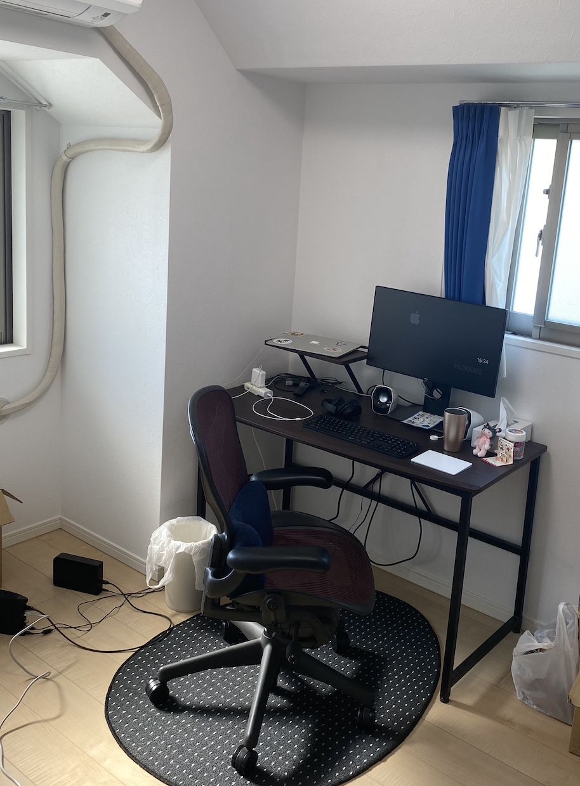

- 約 5.5 畳（窓 2 つ、日当たり良好）
- NURO 光 マンションタイプ（平均 200 - 300 Mbps）⭕
- 中古のアーロンチェア（オフィスバスターズ）
  - 背もたれのオプションは老朽化で廃棄 💀
  - 腰に無印の腰当てクッション ⭕
- アーロンチェアに合うらしい卵型マット（楽天）
- nasne が無線使えなくて汚い（床のケーブル）❌

---

# PC

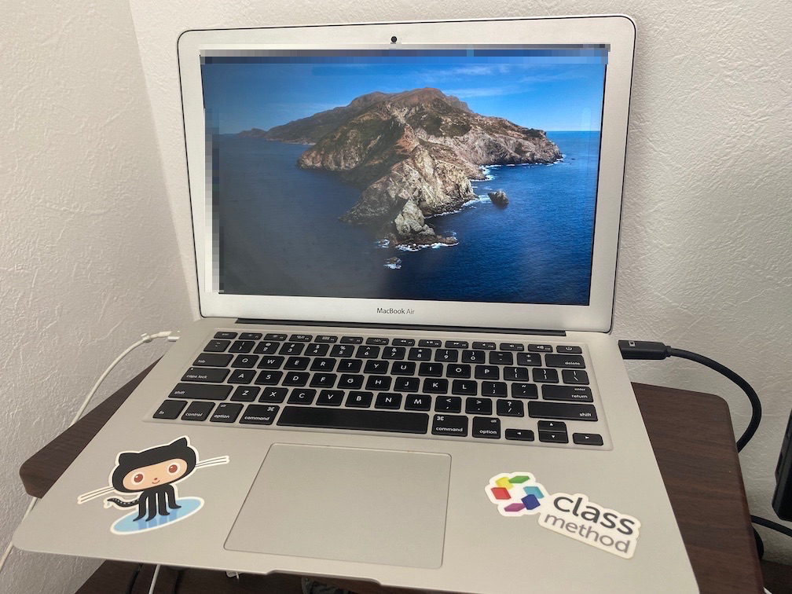

```
- MacBook Air (13-inch, Mid 2013)
- 入社時に支給されたマシン
- MacBook Pro に交換申請中
  - このご時世でも迅速に交換対応してくれる総務は最高！ ⭕
- いつもは閉じて使ってます（クラムシェルモード）
```


---

# 部屋（2020/07 追記）

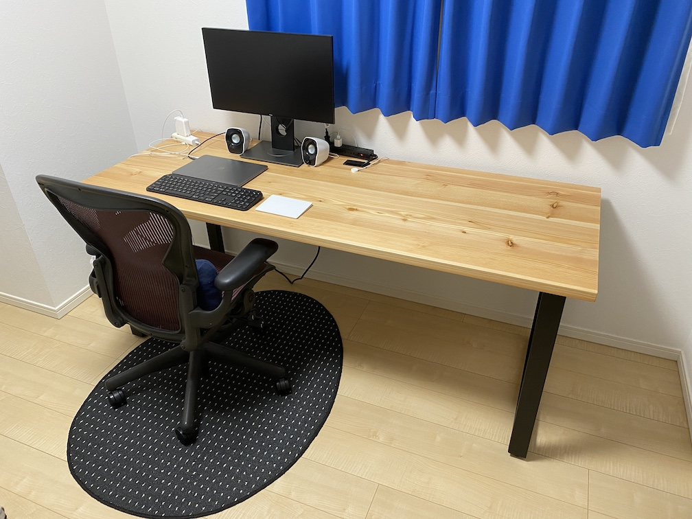

### 7月になってデスクと会社支給 PC が変わりました。

---

# モニター

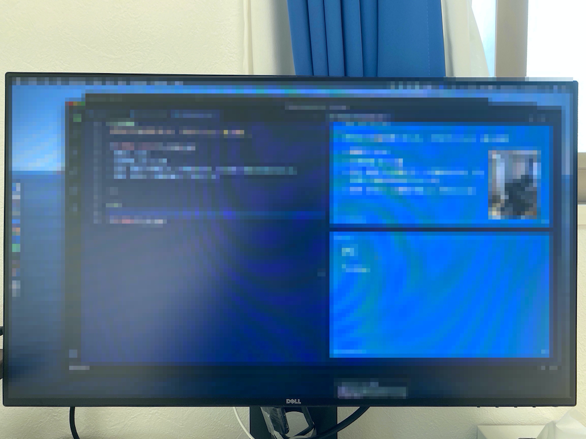

```
- DELL U2417H
- Amazon の新古品で購入、¥24,519
- ベゼル（モニター縁の黒枠）が超薄くて値段の割に満足度高め ⭕
```

[DELL 製品ページのリンク](https://japancatalog.dell.com/pd/U2417H.html)

---

# スピーカー


```
- Logicool Z120BW
- Amazon で購入、¥1,505 ⭕
- コスパ良好、無難 ⭕
```

[Amazon 販売ページのリンク](https://www.amazon.co.jp/gp/product/B0053N3NVW)
今だと ¥1,290 ⭕

---

# ヘッドフォン


```
- Bose QuietComfort 35 Wireless headphones II
- セールのときに購入、¥33,966 🔺
- 集中したい時にノイズキャンセリング目的で使う ⭕
- 仕事中はたまにしか音楽聞かない
```

- [Bose へのリンク](https://www.bose.co.jp/ja_jp/products/headphones/over_ear_headphones/quietcomfort-35-wireless-ii.html)
今だとキャンペーン中で ¥25,641 😲 💘

---

# キーボード

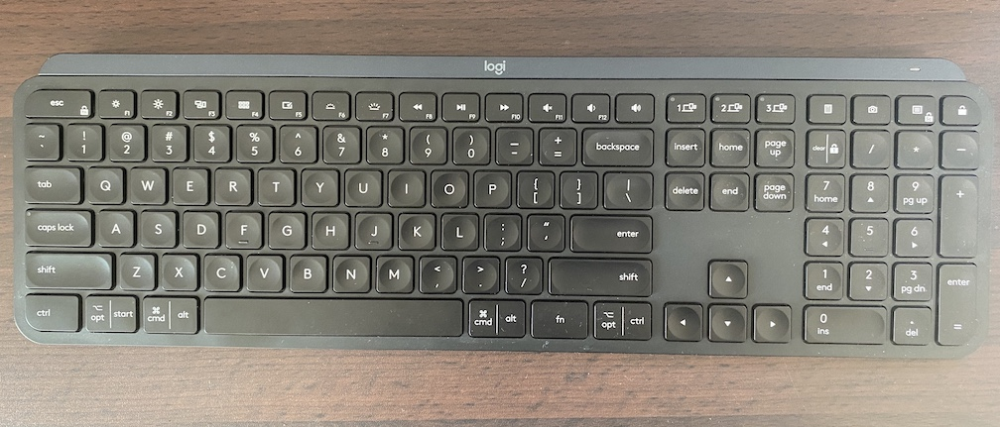

```
- Logicool MXKeys US キー配列
- Big Apple Buddy というサイトで輸入配送購入
  - $206.72 USD（約 ¥22,000）
- PC 3 台まで Bluetooth の接続を切り替えられる（瞬時に切り変わる）⭕
- USB Type-C 充電式、電池持ちは数ヶ月以上 ⭕
- 暗いと自動で光る（要らない）🔺
- 傾斜がいい感じ ⭕
```

- [Logicool へのリンク（JIS レイアウト）](https://www.logicool.co.jp/ja-jp/product/mx-keys-wireless-keyboard)
- [Logitech へのリンク（US レイアウト）](https://www.logitech.com/en-us)

---

# マウス

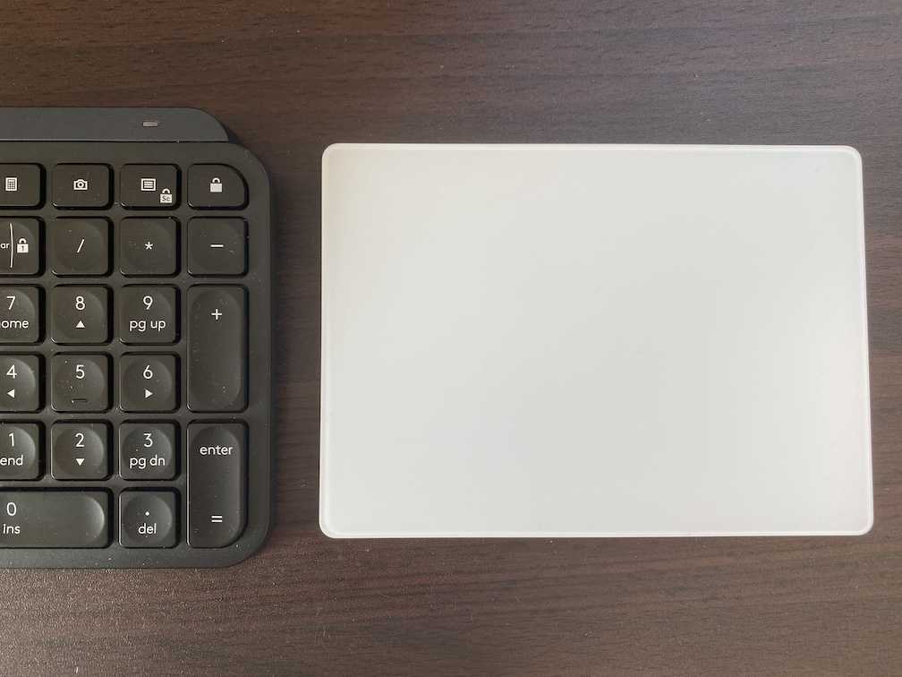

```
- Apple Magic Trackpad 2 - シルバー
- ¥12,800
- Mac のトラックパッドと同じ操作ができる、慣れたら普通のマウスが使いづらくなる（やばい）
- ゲームでは使いづらい ❌
- 電池持ちは数ヶ月以上 ⭕
- 充電が Lightning 端子なのが微妙 🔺
  - でも iPhone を充電したついでにたまに充電すれば OK
```

[Apple へのリンク](https://www.apple.com/jp/shop/product/MJ2R2J/A/)

---

# サブ機

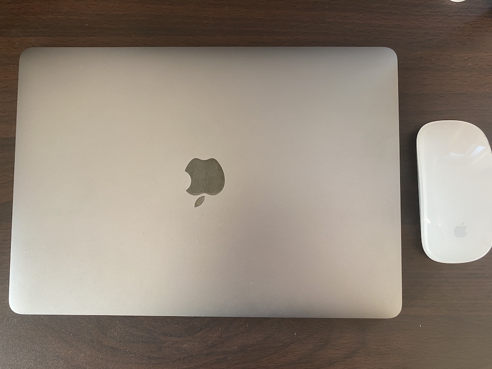

```
- 会社支給じゃない自分のマシン（業務では使わないよ！）
- 13インチMacBook Pro - スペースグレイ
- Apple Magic Mouse（電池式で辛い）
```

---

# 在宅勤務で心がけていること

- 仕事中に息抜きの時間を取る
  - 出社と比較すると出退勤/休憩の境目がない
  - 過労は仕事のパフォーマンスに影響がでる🐜
- 勤務時間内の 100% をデスクで過ごさない
  - コーヒーブレイクしたり☕
  - ストレッチや筋トレしたり💪
- やれることをやればそれで十分

---

# 息抜きの風景1

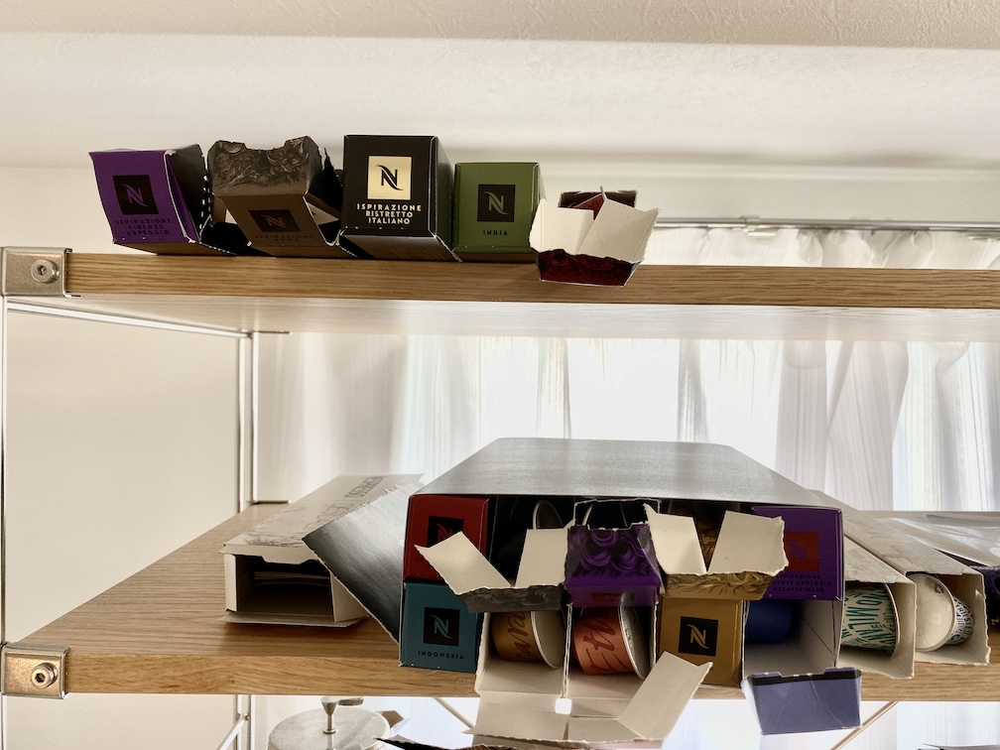


---

# 息抜きの風景2

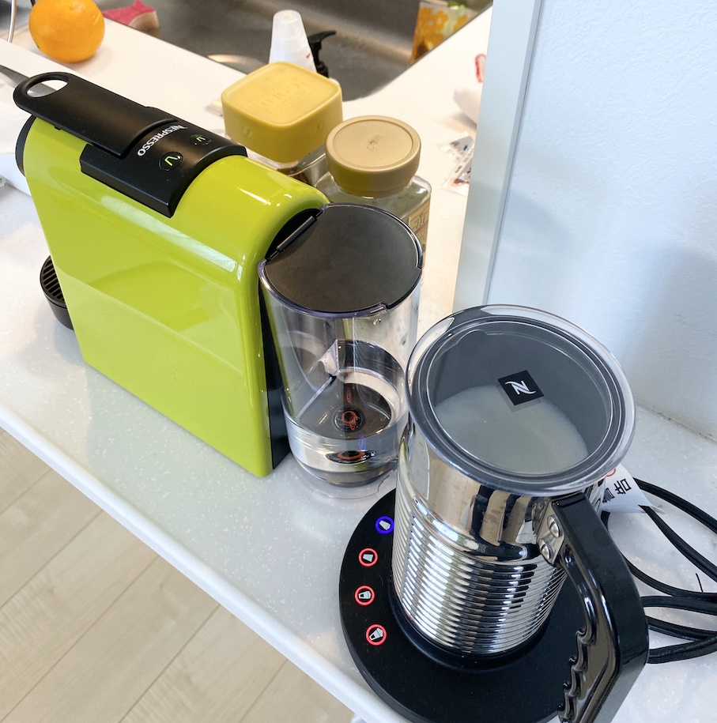

- [エッセンサ ミニ](https://www.nespresso.com/jp/ja/order/machines/original)
- [エアロチーノ4](
https://www.nespresso.com/jp/ja/order/accessories/original/aeroccino-4-milk-frother)

---

# 息抜きの風景3

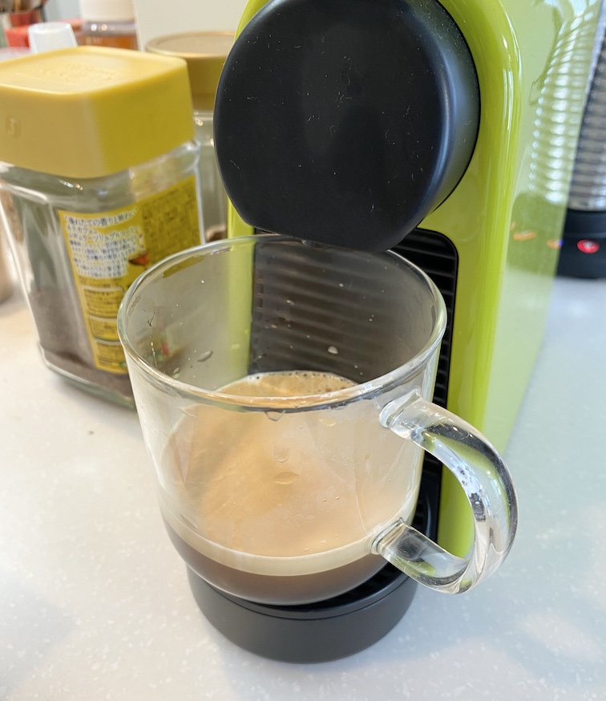

---

# 息抜きの風景4

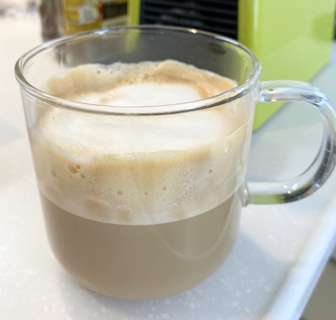

### ☕😩 ← 大体こんな顔しながら飲んでる

---

# おわりに

みなさまのオススメのリモートワークグッズがあれば<br />ぜひ教えてください 🙏

このスライドは Marp を利用して作りました。📝<br />普段から Markdown に慣れている人は<br />使いやすいと思うのでオススメです。

- [Marp - Markdown Presentation Writer](https://yhatt.github.io/marp/)
- [Marpを使ってmarkdownでスライド資料を作成する](https://dev.classmethod.jp/articles/make-slides-from-markdown-with-marp/)